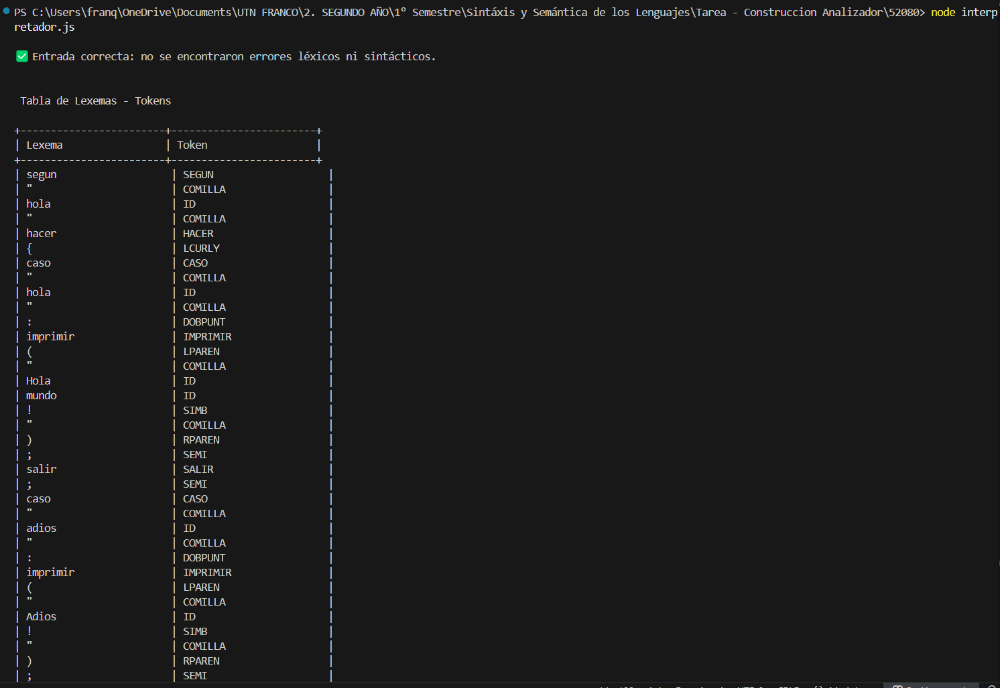
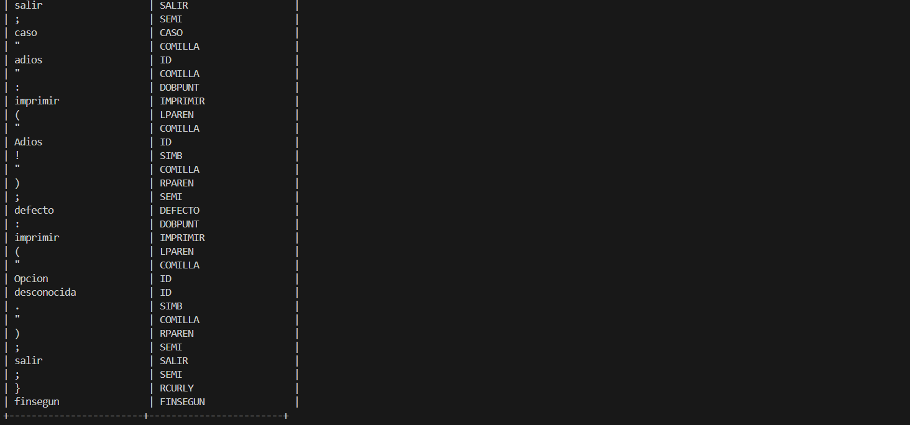
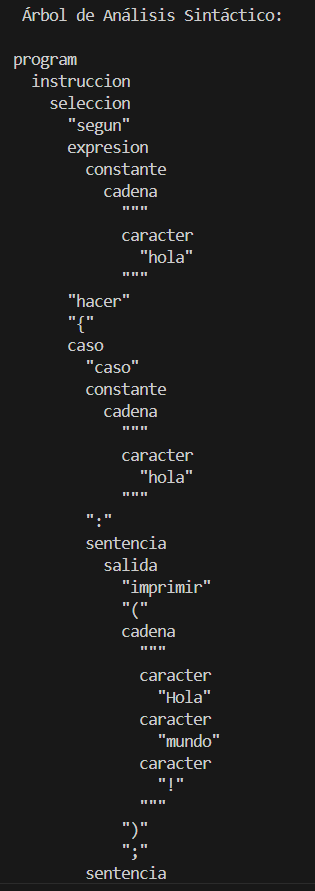
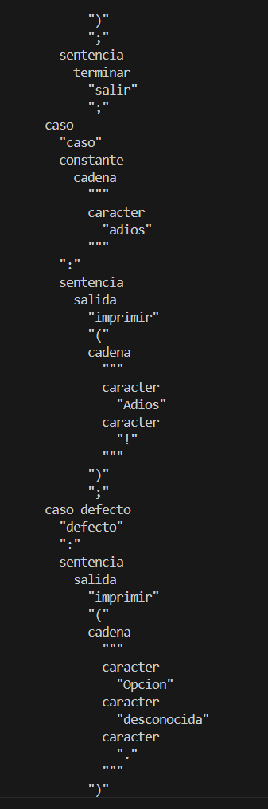
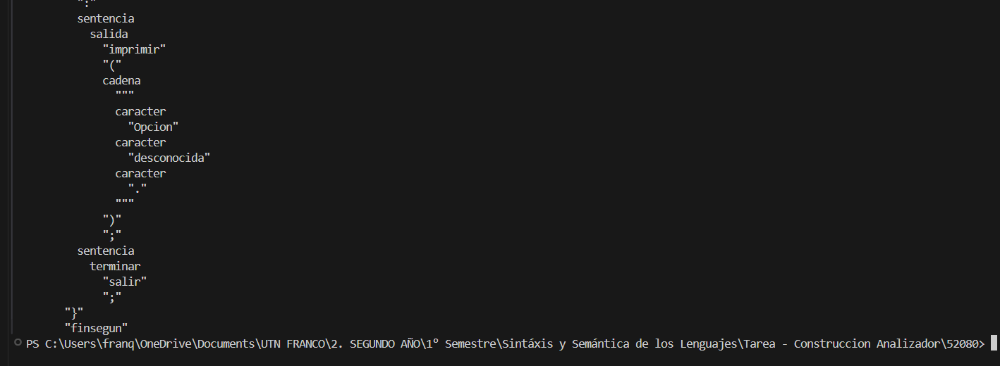

# Analizador Sintáctico con ANTLR y Node.js

- 👨‍🎓 Alumno: Franco Petri  
- 📌 Legajo: 52080  
- 📚 Tema: 39568_5  

---
## Importante:
No usar acentos en la palabras

## 📄 Descripción

Este proyecto es un analizador léxico y sintáctico para un lenguaje de programación simple escrito en español, desarrollado con ANTLR4 y Node.js. El sistema:

1. Realiza análisis léxico y sintáctico.
2. Genera una tabla de lexemas y tokens.
3. Construye un árbol de análisis sintáctico (árbol de derivación).
4. Interpreta el código fuente, traduciéndolo a JavaScript y ejecutándolo como lo haría un intérprete básico.

---

## ⚙️ Requisitos

Antes de ejecutar el proyecto, asegúrate de tener instalado lo siguiente:

- ✅ Node.js (v16 o superior)
- ✅ Java (JDK)
- ✅ ANTLR 4 (versión 4.13 o superior)

---

## 🧭 Instalación

### 🔁 Opción 1: Clonando el Repositorio

1. Clona el repositorio:

git clone https://github.com/FranPetri04/52080.git

2. Accede al proyecto y ábrelo con VS Code:

cd 52080
code .

### 🔁 Opción 2: Descargango el archivo ZIP

1. Entra al repositorio de GitHub.

2. Haz clic en el botón verde que dice “Code” y luego selecciona “Download ZIP”.

3. Extrae el archivo en una carpeta de tu preferencia.

---

## 📁 Archivos Importantes

📜 Analizador.g4: Contiene la gramática ANTLR en español utilizada por el lexer y parser.

✍️ input.txt: Archivo de entrada donde puedes escribir o pegar los códigos fuente de prueba. Incluye ejemplos correctos e incorrectos.

🧩 interpretador.js: Archivo principal que realiza:

    - Análisis léxico
    - Análisis sintáctico
    - Generación de tabla de tokens
    - Generación de árbol de análisis sintáctico

🔁 interpretar.js: Ejecuta la traducción del código fuente al lenguaje JavaScript y lo interpreta dinámicamente.

---

## 🚀 Cómo Ejecutar el Proyecto

▶️ Opción 1: Desde Visual Studio Code (F5)

1. Abre el archivo Analizador.g4.
2. Presiona F5 para generar y visualizar el árbol de derivación (requiere tener el plugin ANTLR instalado).

💻 Opción 2: Desde la Terminal

1. Ejecuta el analizador sintáctico con el comando: node interpretador.js
Esto realiza el análisis léxico y sintáctico, muestra la tabla de tokens y genera el árbol de análisis sintáctico.

2. Ejecuta el intérprete con el comando: node interpretar.js
Esto traduce el código fuente al lenguaje JavaScript y lo ejecuta como si fuera un intérprete real.

---

## 🧪 Ejemplos de Entrada
En la carpeta "EJEMPLOS DE ENTRADAS" encontrarás dos ejemplos de entradas correctas y dos incorrectas en archivos .txt.

Para usarlos:

Abre uno de los archivos de ejemplo.

Copia su contenido.

Pégalo dentro de input.txt.

Guarda el archivo (Ctrl + S )y ejecuta el proyecto.

## Ejemplo de ejecución del proyecto con el input correcto 1:

1. Ejecuto el analizador con el comando node interpretador.js y lanza:

1. Ejecuto el intérprete con el comando node interpretar.js y lanza:

